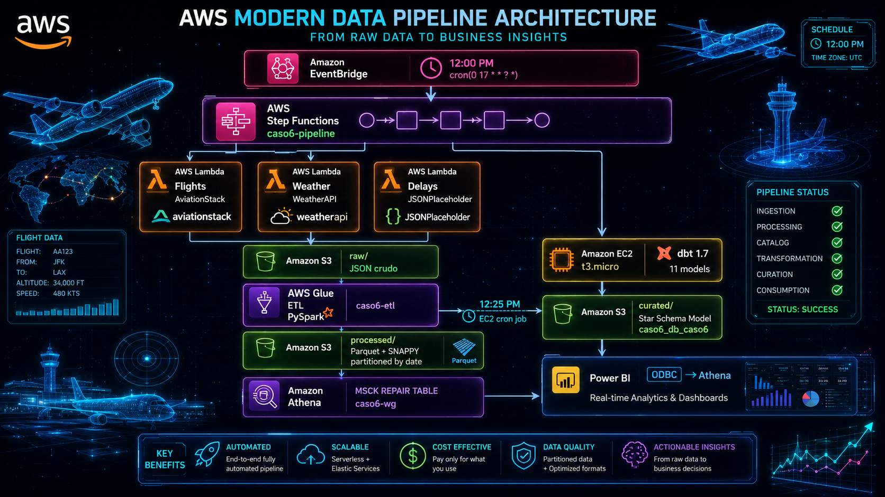

# SkyFlow Lakehouse

> Fully Automated AWS Data Engineering Platform for Aviation Analytics, Weather Intelligence and Operational Incident Monitoring.

<p align="center">
  
</p>

<p align="center">
  
  
  
  
  
  
</p>

---

## Project Overview

SkyFlow Lakehouse is an end-to-end cloud data platform built on AWS that automatically ingests aviation, weather, and operational incident data from multiple APIs.

The solution follows a modern Lakehouse architecture, transforming raw JSON data into analytics-ready datasets using AWS Glue, Athena and dbt. The final dimensional model is exposed through Power BI dashboards for operational decision-making.

### Key Features

- Fully automated daily execution
- Event-driven orchestration
- Multi-source API ingestion
- AWS Lakehouse architecture
- ETL with AWS Glue (PySpark)
- Analytics Engineering with dbt
- Star Schema dimensional modeling
- Athena serverless analytics
- Power BI dashboards

---

## Architecture

> Replace the image below with your final architecture diagram.

<p align="center">
  
</p>

---

## End-to-End Data Flow

```text
EventBridge (12:00 PM)
        │
        ▼
 Step Functions
        │
 ┌──────┼──────┐
 ▼      ▼      ▼
Flights Weather Delays
Lambda  Lambda  Lambda
 └──────┼──────┘
        ▼
    S3 Raw
     (JSON)
        ▼
 AWS Glue ETL
   (PySpark)
        ▼
 S3 Processed
   (Parquet)
        ▼
 Athena Catalog
        ▼
 dbt Models
 (11 Models)
        ▼
 S3 Curated
        ▼
 Power BI
```

---

## Technology Stack

| Layer | Technology |
|---------|------------|
| Orchestration | AWS Step Functions |
| Scheduling | Amazon EventBridge |
| Ingestion | AWS Lambda (Python 3.12) |
| Raw Storage | Amazon S3 |
| Processing | AWS Glue (PySpark) |
| Query Engine | Amazon Athena |
| Transformations | dbt-athena-community |
| Compute | Amazon EC2 t3.micro |
| Visualization | Power BI |
| Language | Python |
| Storage Format | JSON + Parquet |

---

## Data Model

The project implements a dimensional star schema built with dbt.

### Staging Layer

- stg_flights
- stg_weather
- stg_delays

### Intermediate Layer

- int_flights_daily
- int_weather_daily
- int_delays_daily

### Mart Layer

#### Dimensions

- dim_fecha
- dim_aerolinea
- dim_aeropuerto
- dim_condicion_clima

#### Fact Table

- fct_flights_analytics

---

## Project Structure

```text
skyflow-lakehouse/
├── deploy/
│   ├── deploy_caso6_v2.sh
│   └── setup_dbt_v2.sh
├── dbt/
│   ├── dbt_project.yml
│   └── models/
│       ├── staging/
│       ├── intermediate/
│       └── marts/
├── docs/
│   └── SkyFlow_Lakehouse_Guia_Tecnica.docx
└── README.md
```

---

## Quick Start

### 1. Configure Credentials

```bash
nano deploy/deploy_caso6_v2.sh
```

Replace:

```bash
AWS_ACCESS_KEY_ID=YOUR_ACCESS_KEY
AWS_SECRET_ACCESS_KEY=YOUR_SECRET_KEY
AVIATIONSTACK_API_KEY=YOUR_KEY
WEATHERAPI_KEY=YOUR_KEY
```

### 2. Deploy Infrastructure

```bash
bash deploy/deploy_caso6_v2.sh
```

### 3. Create dbt Project

```bash
bash deploy/setup_dbt_v2.sh
```

### 4. Configure EC2 Runner

Follow the complete technical guide located in:

```text
docs/SkyFlow_Lakehouse_Guia_Tecnica.docx
```

---

## Dashboard Layer

Add screenshots of your Power BI dashboards here.

### Executive Dashboard


### Operational Dashboard (EN CONSTRUCCIÓN)


#### Construcción


---

## AWS Services Used

- Amazon S3
- AWS Lambda
- AWS Glue
- Amazon Athena
- AWS Step Functions
- Amazon EventBridge
- Amazon EC2
- AWS IAM

---

## Estimated Monthly Cost

| Service | Estimated Cost |
|----------|---------------|
| Lambda | ~$0.00 |
| Glue | ~$0.07 |
| Athena | ~$0.01 |
| S3 | ~$0.02 |
| Step Functions | ~$0.00 |
| EC2 t3.micro | ~$7.50 |
| Total without EC2 | ~$0.10 |
| Total with EC2 | ~$7.60 |

---

## Skills Demonstrated

### Data Engineering

- ETL Pipelines
- Data Lake Architecture
- Lakehouse Design
- Data Modeling
- Batch Processing

### Cloud Engineering

- AWS Serverless
- Infrastructure Automation
- IAM Permissions
- Athena Analytics

### Analytics Engineering

- dbt
- Star Schema Modeling
- Data Transformations
- Data Quality

### Business Intelligence

- Power BI
- KPI Design
- Operational Analytics

---

## Documentation

Complete deployment guide:

```text
docs/SkyFlow_Lakehouse_Guia_Tecnica.docx
```

---

## Author

Samuel Ruiz

Data Analyst | Data Engineer

AWS • Python • Power BI • dbt • Data Engineering

---

If you found this project useful, consider giving it a star.
